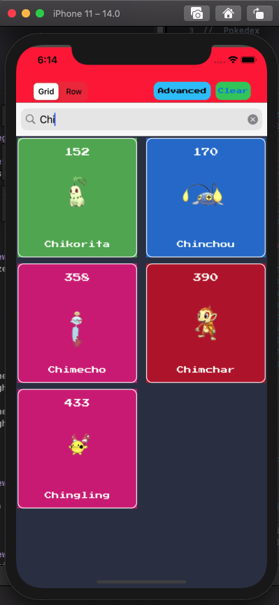
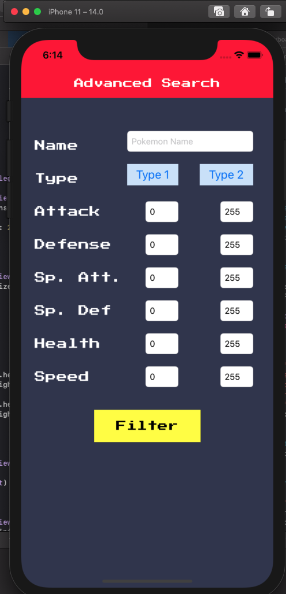
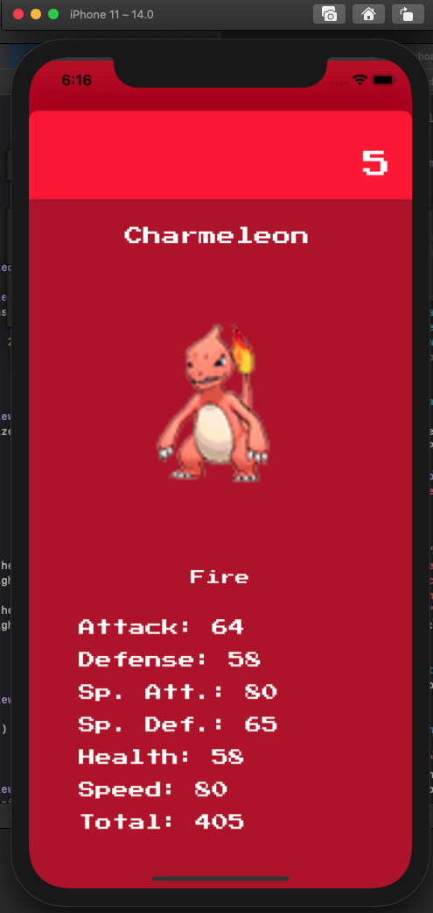

# Pokedex
Mini Project 2

This is a Pokedex app that simulates the virtual device found across Pokemon games to display the name, number, and statistics of Pokemon. This app allows you to search for Pokemon by name or use advanced filters to filter based on type and statistics.

  
This shows the Pokedex in grid view while filtering on the search term "Chi". The app updates automatically to change the data being displayed.

  
This is the screen where users can type in their filters. All values outside the lower bound will return 0 and outside the upper bound will return 255.

 
This is a sample screen showing the details of a selected Pokemon. The background color changes accordingly with the type.
